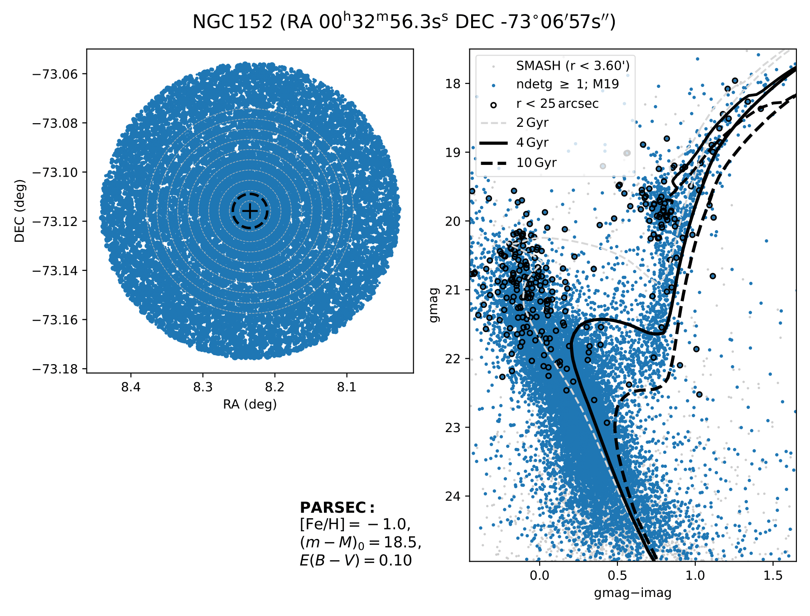
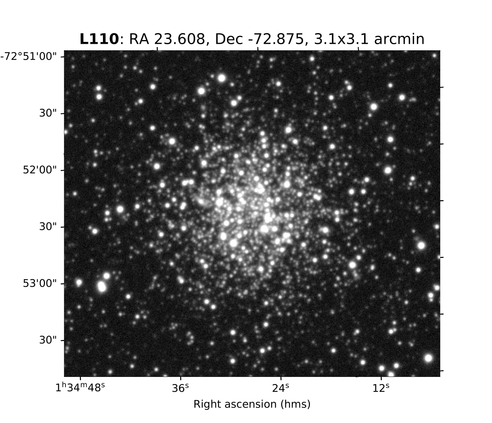

# Query NOIRLab database to get catalogs and image cutouts

This repository contains tools for querying the **NOIRLab Data Lab** (e.g., SMASH DR2, Gaia EDR3) and retrieving the catalogs and image cutouts around sky coordinates.

## Features

- Query NOIRLab databases (e.g., `smash_dr2.object`, `smash_dr2.exposure`).
- Retrieve metadata and catalogs for selected objects.
- Download image cutouts centered on RA/Dec with configurable size.

A YAML file is used to change the input parameters.
So far, it is only possible to download an entire SMASH field (numbered from 1 to 247) or input the name of a cluster listed in Bica catalogues.
The coordinates (or a file with a list of coordinates) or the name of any cluster (to be searched in Vizier) will be made available soon.

## Installation and usage

Clone the repository and install requirements:

```bash
git clone https://github.com/your-username/query_noirlab_data_cutouts.git
cd query_noirlab_data_cutouts
pip install -r requirements.txt
python3 query_noirlab.py query_settings.yaml
```

As it is, the YAML file will download data from the `smash_dr2.object`, using the service.search method (the only method working so far), for the cluster HW77, with a radius of 5 arcmin.

## Example figures: CMD and cutout image

<table>
  <tr>
    <td></td>
    <td></td>
  </tr>
  <tr>
    <td align="center"><sub>Example of a CMD downloaded for the cluster NGC152.</sub></td>
    <td align="center"><sub>Example of an image cutout for the cluster L110.</sub></td>
  </tr>
</table>


Last updated: 04 Sep 2025
